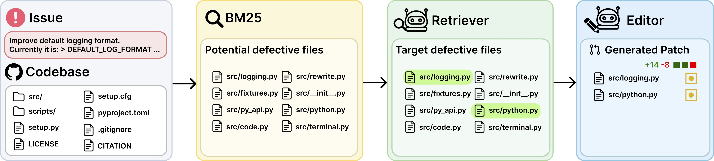

<h1 align="center"> SWE-Fixer: Training Open-Source LLMs for Effective and Efficient GitHub Issue Resolution </h1>

<p align="center">
  <a href="https://yitianlian.github.io/" style="text-decoration: none;">Chengxing Xie<sup>*,1,2</sup></a>, 
  <a href="https://scholar.google.com/citations?user=RLWXNf8AAAAJ&hl=en" style="text-decoration: none;">Bowen Li<sup>*,1</sup></a>,
  <a href="https://gao-xiao-bai.github.io/" style="text-decoration: none;">Chang Gao<sup>*,1,3</sup></a>,
  <a href="https://kinza99.github.io/" style="text-decoration: none;">He Du<sup>1</sup></a>,
  <a href="https://www.se.cuhk.edu.hk/people/academic-staff/prof-lam-wai/" style="text-decoration: none;">Wai Lam<sup>3</sup></a>,
  <a href="https://difanzou.github.io/" style="text-decoration: none;">Difan Zou<sup>4</sup></a>,
  <a href="https://chenkai.site/" style="text-decoration: none;">Kai Chen<sup>^,1</sup></a>
</p>


<p align="center">
  <sup>1</sup>Shanghai AI Laboratory, <sup>2</sup>Xidian University, <sup>3</sup>The Chinese University of Hong Kong, <sup>4</sup>The University of Hong Kong </br>
  <sub><sup>*</sup>Equal contribution, <sup>^</sup>Corresponding author</sub>

<p align="center">
  <a href="https://arxiv.org/abs/2501.05040" style="text-decoration: none;">
    <span style="background-color: #333; color: white; padding: 10px 20px; border-radius: 20px; margin: 8px; font-size: 14px; font-weight: bold; display: inline-block; box-shadow: 2px 2px 6px rgba(0, 0, 0, 0.2);">
      📄 Paper
    </span>
  </a>
 
</p>

</p>

<p align="center">
  
</p>
 

SWE-Fixer is a simple yet effective solution for addressing real-world GitHub issues by training open-source LLMs. It features a streamlined retrieve-then-edit pipeline with two core components:  
🔍 **A Code File Retriever** and ✏️ **A Code Editor**.

For implementation, we finetune **Qwen2.5-7b** and **Qwen2.5-72b** for the retriever and the editor respectively, leveraging a curated dataset of **110K instances**. SWE-Fixer achieves **state-of-the-art performance** among open-source solutions with open-source models achieving:

- 🔹 **23.3%** on SWE-Bench Lite
- 🔹 **30.2%** on SWE-Bench Verified


# Models and Datasets  

Models:

- **[🤗 SWE-Fixer-Retriever-7B](https://huggingface.co/internlm/SWE-Fixer-Retriever-7B)**  
  🔍 Finetuned for the **code file retrieval task**, this model takes issue descriptions and BM25-retrieved results as input and identifies the defective files related to the issue.  

- **[🤗 SWE-Fixer-Editor-72B](https://huggingface.co/internlm/SWE-Fixer-Editor-72B)**  
  ✏️ Designed for the **code editing task**, this model processes issue descriptions and corresponding file content to generate modification patches for resolving the issue.  

Datasets:
- **[🤗 SWE-Fixer-Train-110K](https://huggingface.co/datasets/internlm/SWE-Fixer-Train-110K)**  
  📂 This dataset contains nearly **110K detailed instances** collected from real-world GitHub repositories, forming the training data of our model training pipeline.  

- **[🤗 SWE-Fixer-Eval](https://huggingface.co/datasets/internlm/SWE-Fixer-Eval)**  
  📊 This evaluation dataset includes **SWE-Bench Lite and Verified instance**, BM25-retrieval results for SWE-Bench Lite and Verified, and code structure for each instance, enabling convenient evaluation.  


# Run the Pipeline

## Environment Setup

Download and install our inference environment package [SWE_Fixer.tar.gz](https://drive.google.com/file/d/1slyfDUEA5lrfr4IO79xezjyZqLIKPIvh/view?usp=sharing). Use the following commands:
```bash
mkdir {your_conda_environment_dir/SWE_Fixer}
tar -xzvf SWE_Fixer.tar.gz -C {your_conda_environment_dir/SWE_Fixer}
```
Activate the environment:
```bash
conda activate SWE_Fixer
```

## Prepare Models and Evaluation Datasets

Download the models and datasets and save them to the default locations:
```bash
mkdir model
huggingface-cli login
huggingface-cli download --resume-download internlm/SWE-Fixer-Retriever-7B --local-dir ./model/retrieval_model
huggingface-cli download --resume-download internlm/SWE-Fixer-Editor-72B --local-dir ./model/editing_model
huggingface-cli download internlm/SWE-Fixer-Eval --repo-type dataset --local-dir ./eval_data
```
Alternatively, specify paths in the scripts by modifying `MODEL_DIR` in `scripts/run_evaluation.sh` and `EVAL_DATA_DIR` in `scripts/run_evaluation.sh`. 

## Run the Retrieval Model

Run the retrieval pipeline (default to the `lite` dataset):
```bash
scripts/run_evaluation.sh --mode retrieval
```
To use the `verified` dataset, execute:
```bash
scripts/run_evaluation.sh --mode retrieval --dataset verified
```
Retrieval results will be saved in the `result` directory.


## Run the Editing Model

After completing the retrieval step, run the editing pipeline based on the retrieval results:
```bash
scripts/run_evaluation.sh --mode editing
```
To use the `verified` dataset, execute:
```bash
scripts/run_evaluation.sh --mode editing --dataset verified
```
Editing results will also be saved in the `result` directory.


## Evaluate the Results

We evaluate the pipeline results using the **all-hands evaluation approach**. Refer to the evaluation guide here: [Evaluation Guide Link](https://github.com/All-Hands-AI/OpenHands/tree/main/evaluation/benchmarks/swe_bench#swe-bench-evaluation-with-openhands-swe-bench-docker-image).


## Notes

- Ensure all scripts are executable. Use `chmod +x` if necessary.
- The exact paths for scripts and datasets must be updated to match your local setup.
- If you encounter issues during deployment or execution, refer to the respective repositories and documentation.
- The inference results may vary depending on your device or settings. 

# Citation
```
@article{xie2025swefixer,
  title={SWE-Fixer: Training Open-Source LLMs for Effective and Efficient GitHub Issue Resolution}, 
  author={Xie, Chengxing and Li, Bowen and Gao, Chang and Du, He and Lam, Wai and Zou, Difan and Chen, Kai},
  journal={arXiv preprint arXiv:2501.05040},
  year={2025}
}
```

# Acknowledgements
- [Agentless](https://github.com/OpenAutoCoder/Agentless)
- [OpenHands](https://github.com/All-Hands-AI/OpenHands)
- [SWE-Bench](https://www.swebench.com/)